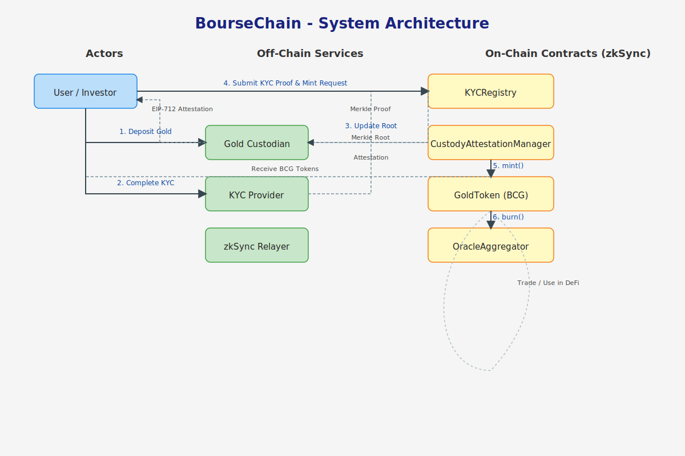

# BourseChain: A Framework for Regulated, Asset-Backed Tokens

[](https://opensource.org/licenses/MIT)
[](#)
[](#)

BourseChain is a comprehensive and secure framework for issuing regulated, asset-backed tokens on EVM-compatible blockchains like zkSync. It provides a modular architecture for bridging traditional commodity markets with the efficiency and global reach of decentralized finance (DeFi). This implementation focuses on a token backed by physical gold, but the system is designed to be adaptable for other assets.

## Architecture Overview

The BourseChain ecosystem is designed with a clear separation between off-chain and on-chain components to ensure security, scalability, and regulatory compliance.



- **On-Chain (EVM L2):** A suite of smart contracts governs the token lifecycle, including minting, redemption, transfers, and regulatory compliance.
- **Off-Chain:** Trusted entities manage physical assets and data.
  - **Custodian:** A licensed financial institution that holds the physical asset (e.g., gold) in a secure vault. They are responsible for issuing signed EIP-712 attestations for minting new tokens against deposited assets.
  - **KYC Provider:** An off-chain service that verifies user identities and provides the data for the on-chain `KYCRegistry`. In this implementation, this is done by publishing a Merkle root of approved addresses.
  - **Oracles:** Provide trusted, signed price feeds for the token, which is essential for any potential derivatives and other financial products.

### Core User Flow
1.  **KYC Verification:** A user completes KYC with an off-chain provider. The provider adds the user's address to a whitelist and the `KYCRegistry` is updated with a new Merkle root. The user can then submit a Merkle proof to the `KYCRegistry` to mark their address as verified on-chain.
2.  **Deposit & Attestation:** A user deposits a physical asset with the Custodian, who then provides a signed EIP-712 attestation for the corresponding token amount.
3.  **Minting:** The user submits the custodian's attestation to the `CustodyAttestationManager` contract, which verifies the signature and mints new `BCG` tokens to the user's address.
4.  **Trading & DeFi:** The user can now trade `BCG` tokens, use them as collateral, or participate in other DeFi applications, subject to the KYC rules of the `GoldToken` contract.
5.  **Redemption:** To redeem the underlying asset, the user calls the `redeem` function on the `GoldToken` contract, which burns their tokens (minus a fee). This creates an on-chain event that the Custodian uses to facilitate the physical asset withdrawal.

## Contract Overview

The core logic is modularized into several key contracts:

-   `GoldToken.sol`: The central, regulated ERC20 token (`BCG`). It enforces KYC checks on transfers and handles the redemption (burn) process. It also includes pausable transfers and fee management.
-   `CustodyAttestationManager.sol`: The only contract with the authority to mint new `GoldToken`s. It does so by verifying EIP-712 signatures from a trusted off-chain custodian.
-   `KYCRegistry.sol`: Manages user verification status. This implementation uses a Merkle root provided by a `KYC_ADMIN_ROLE` to maintain a whitelist. Users prove their inclusion to become verified.
-   `OracleAggregator.sol`: Maintains a trusted on-chain price feed. It is updated via EIP-712 signed price reports from trusted oracles.
-   `TimelockAndMultisigProxy.sol`: This file documents the recommended governance pattern. Sensitive administrative actions should be controlled by a multi-signature wallet with a mandatory timelock, providing a delay for all major changes.
-   **Options Module (Skeleton):**
    -   `OptionFactory.sol`: A placeholder contract intended to create new option series.
    -   `OptionToken.sol`: A placeholder ERC1155 contract for representing option positions.
    -   `ClearingHouse.sol`: A placeholder contract for managing collateral and settling options.

## Quickstart

### Prerequisites
- [Node.js](https://nodejs.org/en/) (>=18.x)
- [npm](https://www.npmjs.com/)
- [Git](https://git-scm.com/)

### 1. Clone the Repository
```bash
git clone https://github.com/your-org/BourseChain.git
cd BourseChain
```

### 2. Install Dependencies
```bash
npm install
```

### 3. Set Up Environment Variables
Copy the `.env.example` file to a new file named `.env` and fill in the required variables.
```bash
cp .env.example .env
```
You will need to provide a `DEPLOYER_PRIVATE_KEY` and other keys/RPC URLs for testing and deployment.

### 4. Run Tests
To ensure everything is configured correctly, run the comprehensive test suite.
```bash
npx hardhat test
```

### 5. Compile Contracts
```bash
npx hardhat compile
```

### 6. Deploy
The project includes a comprehensive deployment script. To deploy to a network (e.g., zkSync Testnet), first configure the network in `hardhat.config.js` and add the relevant RPC URL to your `.env` file.
```bash
# Example for a network named 'zksync_testnet'
npx hardhat deploy --network zksync_testnet
```
The deployment script in `scripts/deploy/deploy-all.js` handles the deployment and linking of all the core contracts in the correct order.

## Security
Security is the highest priority. Our approach includes:
- **Audits:** The codebase is intended to undergo multiple independent security audits before mainnet deployment.
- **Best Practices:** Use of modern, battle-tested libraries like OpenZeppelin. Key contracts use patterns like ReentrancyGuard.
- **Access Control:** Strict role-based access control for all sensitive functions (e.g., `MINTER_ROLE`, `KYC_ADMIN_ROLE`, `PAUSER_ROLE`).
- **Secure Governance:** Recommendation of a Timelock/Multisig admin pattern for all administrative control, preventing single points of failure and providing time for community review of changes.
- **For a detailed checklist, see [docs/security_audit_checklist.md](./docs/security_audit_checklist.md).**

## License
This project is licensed under the MIT License. See the [LICENSE](./LICENSE) file for details.
