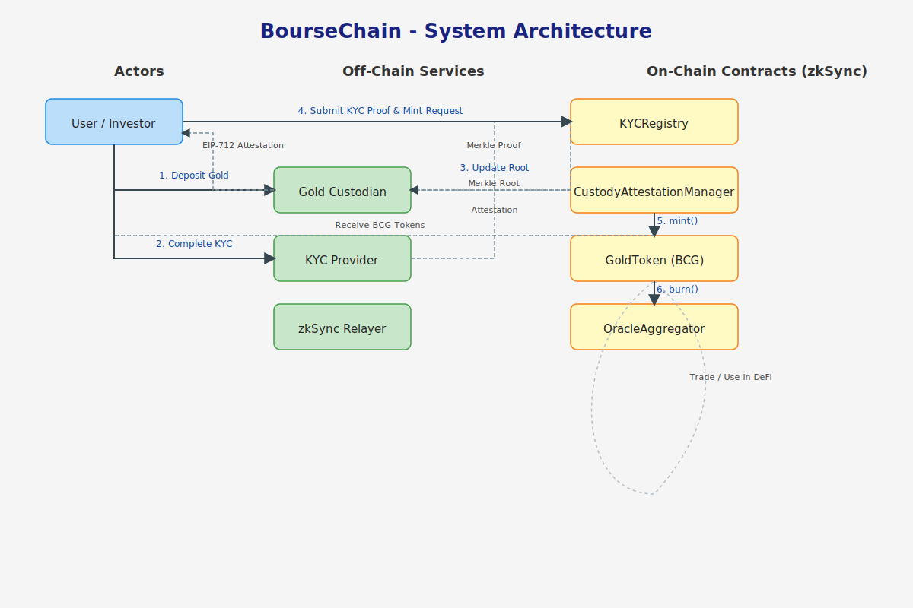

# BourseChain: Tokenized Gold on zkSync

[](https://opensource.org/licenses/MIT)
[](#)
[](#)

این پروژه یک زیرساخت برای توکنیزه کردن گواهی سپرده شمش طلا در بورس کالای ایران بر بستر بلاکچین فراهم می‌کند. هدف اصلی، ایجاد دسترسی شفاف و مدرن به این دارایی برای سرمایه‌گذاران داخلی و بین‌المللی است.

BourseChain provides a robust, secure, and transparent platform for tokenizing Iranian Commodity Exchange (IME) gold warehouse receipts on the zkSync Layer 2 network. Our goal is to bridge traditional commodity markets with the efficiency and global reach of decentralized finance (DeFi).

## Architecture Overview

The BourseChain ecosystem is designed with a clear separation between off-chain and on-chain components to ensure security, scalability, and regulatory compliance.



- **On-Chain (zkSync L2):** A suite of smart contracts governs the token lifecycle, including minting, burning, transfers, and KYC compliance.
- **Off-Chain:** Trusted entities manage physical assets and data.
  - **Custodian:** A licensed financial institution that holds the physical gold bars in a secure vault. They are responsible for issuing signed EIP-712 attestations for minting new tokens against deposited gold.
  - **KYC Provider:** An off-chain service that verifies user identities and publishes a Merkle root of approved addresses to the on-chain `KYCRegistry`.
  - **Oracles:** Provide trusted, signed price feeds for the gold token, which is essential for derivatives and other financial products.

### Core Flow
1.  **Deposit & Attestation:** A user deposits physical gold with the Custodian, who then provides a signed EIP-712 attestation.
2.  **KYC Verification:** A user completes KYC with the off-chain provider. The provider adds the user's address to a whitelist and updates the on-chain Merkle root in the `KYCRegistry`.
3.  **Minting:** The user submits their Merkle proof to the `KYCRegistry` to get verified, then submits the custodian's attestation to the `CustodyAttestationManager` to mint new `BCG` tokens.
4.  **Trading & DeFi:** The user can now trade `BCG` tokens, use them as collateral, or participate in other DeFi applications.
5.  **Redemption:** To redeem physical gold, the user burns their `BCG` tokens, which generates a redemption event. The Custodian then arranges for the physical asset withdrawal.

## Quickstart

### Prerequisites
- [Node.js](https://nodejs.org/en/) (>=18.x)
- [npm](https://www.npmjs.com/)
- [Git](https://git-scm.com/)

### 1. Clone the Repository
```bash
git clone https://github.com/your-org/BourseChain.git
cd BourseChain
```

### 2. Install Dependencies
```bash
npm install
```

### 3. Set Up Environment Variables
Copy the `.env.example` file to a new file named `.env` and fill in the required variables.
```bash
cp .env.example .env
```
You will need to provide a `DEPLOYER_PRIVATE_KEY` and other keys for testing and deployment.

### 4. Run Tests
To ensure everything is configured correctly, run the comprehensive test suite.
```bash
npx hardhat test
```

### 5. Compile Contracts
```bash
npx hardhat compile
```

### 6. Deploy to zkSync Testnet
Make sure your `.env` file has a `DEPLOYER_PRIVATE_KEY` with testnet funds and the correct `ZKSYNC_TESTNET_RPC_URL`.
```bash
npm run deploy:testnet
```

## File Structure
```
BourseChain/
├── contracts/         # All Solidity smart contracts
│   ├── interfaces/    # Contract interfaces
│   └── ...
├── scripts/           # Deployment and utility scripts
│   ├── deploy/
│   └── ...
├── test/              # Hardhat test files
│   ├── shared/
│   └── ...
├── docs/              # Detailed project documentation
├── .github/           # CI/CD workflows and templates
├── images/            # SVG/PNG diagrams
└── ...
```

## Tokenomics Summary
- **Token:** `BourseChain Gold (BCG)`
- **Backing:** 1 `BCG` token represents 1 gram of 999.9 purity physical gold held by a licensed custodian.
- **Decimals:** 18
- **Minting Fee:** A small percentage fee charged on minting new tokens.
- **Redemption Fee:** A small percentage fee charged on burning tokens to redeem physical gold.
- **For more details, see [docs/tokenomics.md](./docs/tokenomics.md).**

## Security
Security is our highest priority. Our approach includes:
- **Audits:** The codebase is intended to undergo multiple independent security audits before mainnet deployment.
- **Best Practices:** Use of OpenZeppelin contracts, ReentrancyGuard, and the Timelock/Multisig admin pattern.
- **Access Control:** Strict role-based access control for all sensitive functions.
- **Oracles:** Use of trusted, signed price feeds to prevent manipulation.
- **For a detailed checklist, see [docs/security_audit_checklist.md](./docs/security_audit_checklist.md).**

## License
This project is licensed under the MIT License. See the [LICENSE](./LICENSE) file for details.
